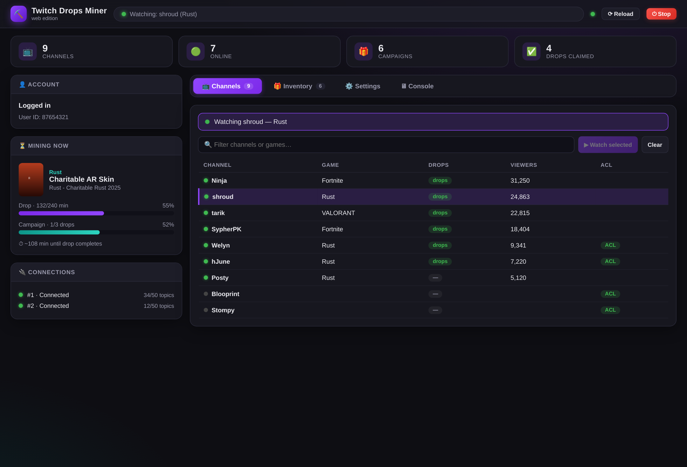
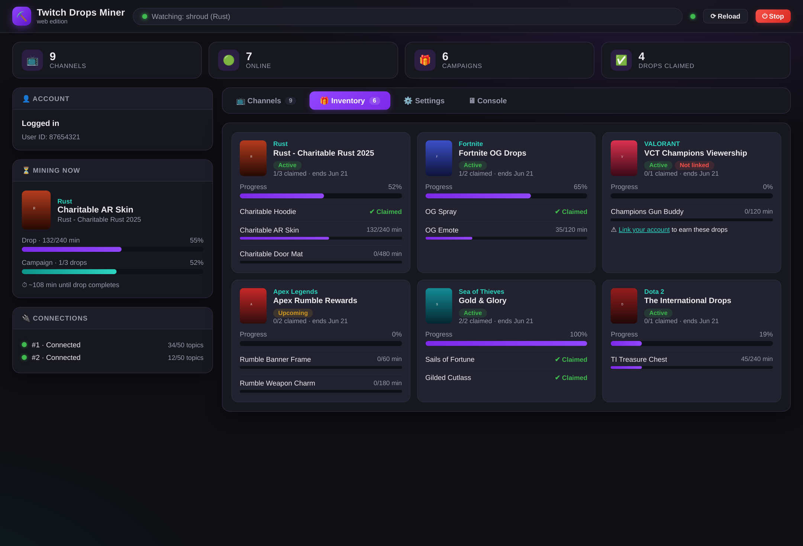
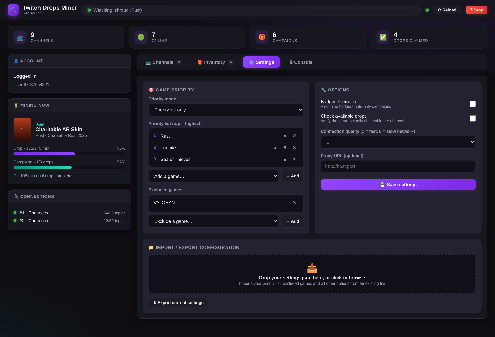

# Twitch Drops Miner — Web Edition

This application allows you to AFK mine timed Twitch drops, without having to worry about switching channels when the one you were watching goes offline, claiming the drops, or even receiving the stream data itself. This helps you save on bandwidth and hassle.

**This fork runs as a headless web server** — there is no desktop window. You start it on any machine (it was made with the Raspberry Pi in mind), open `http://<host>:5001` in a browser, and control everything from a modern web interface: login, channel switching, inventory, settings, and live console output.

### How It Works:

Every several seconds, the application pretends to watch a particular stream by fetching stream metadata - this is enough to advance the drops. Note that this completely bypasses the need to download any actual stream video and sound. To keep the status (ONLINE or OFFLINE) of the channels up-to-date, there's a websocket connection established that receives events about streams going up or down, or updates regarding the current amount of viewers.

### Features:

- **Runs as a web server on port `5001`** - perfect for a Raspberry Pi or any headless box; control it from any device on your network.
- **Live web dashboard** - real-time updates pushed to the browser (no refreshing): current drop progress, channel list, campaign inventory, websocket connection status and console output.
- Stream-less drop mining - save on bandwidth.
- Game priority and exclusion lists, allowing you to focus on mining what you want, in the order you want, and ignore what you don't want.
- **Settings import / export** - drag & drop an existing `settings.json` into the web UI to import your priority list, excluded games and all other options; export the current configuration with one click.
- Sharded websocket connection, allowing for tracking up to `199` channels at the same time.
- Automatic drop campaigns discovery based on linked accounts (requires you to do [account linking](https://www.twitch.tv/drops/campaigns) yourself though).
- Stream tags and drop campaign validation, to ensure you won't end up mining a stream that can't earn you the drop.
- Automatic channel stream switching, when the one you were currently watching goes offline, as well as when a channel streaming a higher priority game goes online - or switch manually from the channel list in the browser.
- Login session is saved in a cookies file, so you don't need to login every time.
- Login via Twitch's device-code flow (a code shown in the web UI that you enter on twitch.tv/activate) or username/password with 2FA support.
- Mining is automatically started as new campaigns appear, and stopped when the last available drops have been mined.
- Systemd service file included for automatic start on boot.

### Pictures:





### Requirements:

- Python 3.10 or higher
- Any OS that runs Python (developed for Linux / Raspberry Pi OS; no display server needed)

### Installation:

```bash
git clone https://github.com/Mates1499/TwitchDropsMiner.git
cd TwitchDropsMiner
pip install -r requirements.txt
```

### Usage:

```bash
python main.py
```

Then open `http://<ip-of-the-machine>:5001` in your browser (e.g. `http://192.168.1.50:5001`, or `http://localhost:5001` on the same machine).

1. **Log in** - the Account panel shows a device activation code: open the displayed link, enter the code, and the miner picks the session up automatically. The session is saved to `cookies.jar`, so this is only needed once.
2. After a successful login, the app fetches all available campaigns and games you can mine drops for. Go to the **Settings** tab and add your games of choice to the **Priority list**, then press **⟳ Reload** in the header to start processing.
3. The miner fetches all applicable streams and starts mining right away. You can manually switch channels from the **Channels** tab at any time (click a channel, then *Watch selected*).
4. If you wish to keep the miner occupied beyond your priority list, use the **Priority mode** setting to control the mining order for the remaining games.
5. Already have a `settings.json` from a previous installation (including the original desktop version)? Drag & drop it into the **Import / export configuration** box on the Settings tab.
6. Make sure to link your Twitch account to game accounts on the [campaigns page](https://www.twitch.tv/drops/campaigns), to enable more games to be mined.

#### Command line options:

```
python main.py [-v] [--log] [--dump]
  -v          increase logging verbosity (repeatable, up to -vvvv)
  --log       also write log output to log.txt
  --dump      dump campaign data and exit
```

### Run on boot (Raspberry Pi / systemd):

A ready-made service file is included. Adjust the `User=` and `WorkingDirectory=`/`ExecStart=` paths inside it to match your setup, then:

```bash
sudo cp twitchdropsminer.service /etc/systemd/system/
sudo systemctl daemon-reload
sudo systemctl enable --now twitchdropsminer
```

Check its status and logs with:

```bash
systemctl status twitchdropsminer
journalctl -u twitchdropsminer -f
```

### Notes:

> [!WARNING]
> Due to how Twitch handles the drop progression on their side, watching a stream in the browser (or by any other means) on the same account that is actively being used by the miner, will usually cause the miner to misbehave, reporting false progress and getting stuck mining the current drop.
>
> Using the same account to watch other streams during mining is thus discouraged, in order to avoid any problems arising from it.

> [!CAUTION]
> Persistent cookies will be stored in the `cookies.jar` file, from which the authorization (login) information will be restored on each subsequent run. Make sure to keep your cookies file safe, as the authorization information it stores can give another person access to your Twitch account, even without them knowing your password!

> [!CAUTION]
> The web interface has **no authentication** and is intended for use on a trusted local network only. Do not expose port `5001` directly to the internet - anyone who can reach it can control the miner. If you need remote access, put it behind a reverse proxy with authentication (e.g. nginx + basic auth) or use a VPN/Tailscale.

> [!IMPORTANT]
> Successfully logging into your Twitch account in the application may cause Twitch to send you a "New Login" notification email. This is normal - you can verify that it comes from your own IP address. The detected browser during the login will be "Chrome", as that's what the miner currently presents itself to the Twitch server.

> [!NOTE]
> The remaining-time values shown in the web UI are an approximation, refreshed whenever Twitch reports drop progress. Twitch sometimes does not report progress at all, or reports progress for the wrong drop - these cases have all been accounted for in the application, which falls back to querying the current drop directly.

### Web API:

The web UI is driven by a small JSON API that you can also use yourself (e.g. for Home Assistant or scripts):

| Method | Endpoint                    | Description                                      |
| ------ | --------------------------- | ------------------------------------------------ |
| GET    | `/`                         | The web interface                                |
| GET    | `/api/state`                | Full miner state as JSON                         |
| GET    | `/api/events`               | Server-sent events stream with live updates      |
| GET    | `/api/settings/export`      | Download the current `settings.json`             |
| POST   | `/api/settings`             | Update settings (JSON body)                      |
| POST   | `/api/settings/import`      | Upload a `settings.json` (raw JSON body)         |
| POST   | `/api/login`                | Submit login credentials                         |
| POST   | `/api/channels/select`      | Switch to a channel (`{"channel_id": "..."}`)    |
| POST   | `/api/reload`               | Trigger an inventory refetch                     |
| POST   | `/api/close`                | Shut the miner down                              |

### Support

If you encounter any issues with the miner:

- Check the **Console** tab in the web UI for error output, or run with `--log -v` for more detail.
- Please [search the issues page](https://github.com/Mates1499/TwitchDropsMiner/issues) to see if your issue hasn't been reported yet, and open a new issue if not.

### Credits:

This is a fork of [DevilXD/TwitchDropsMiner](https://github.com/DevilXD/TwitchDropsMiner), which provides all of the underlying mining logic. The original desktop GUI has been replaced with a web server interface in this fork. If you find the mining core useful, please consider supporting the original author:

<div align="center">

[](
    https://www.buymeacoffee.com/DevilXD
)
[](
    https://www.patreon.com/bePatron?u=26937862
)

</div>
